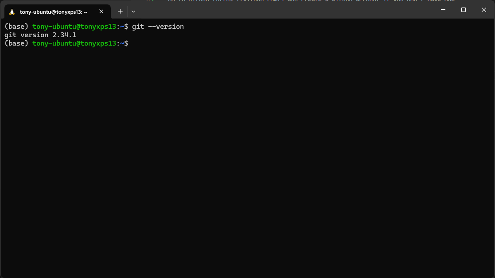
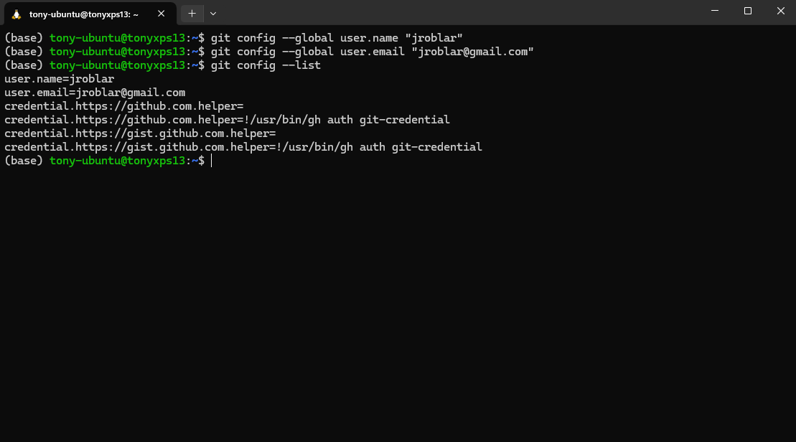
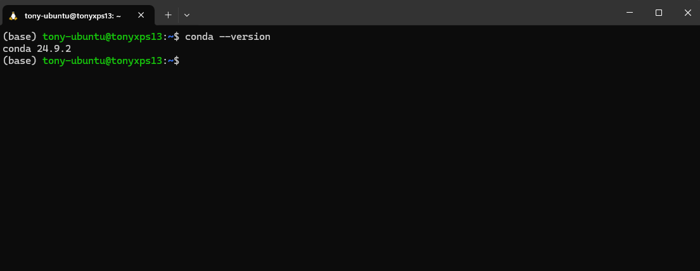
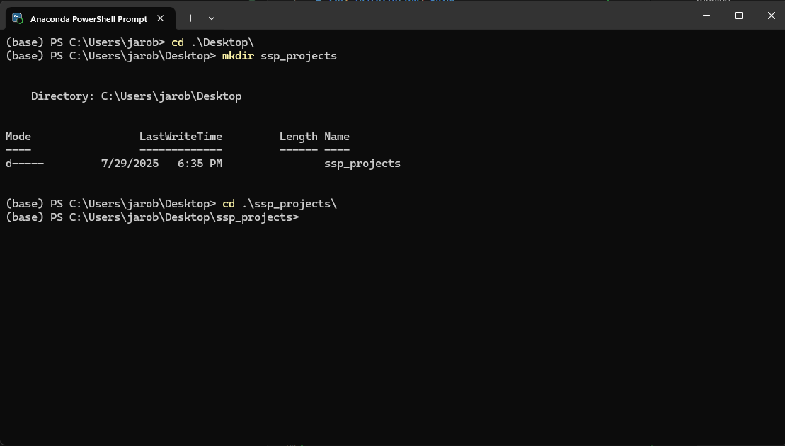
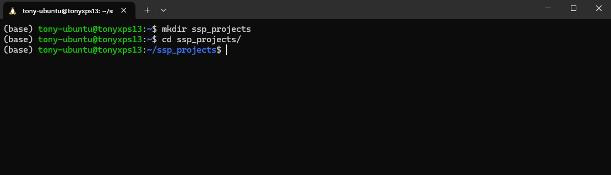
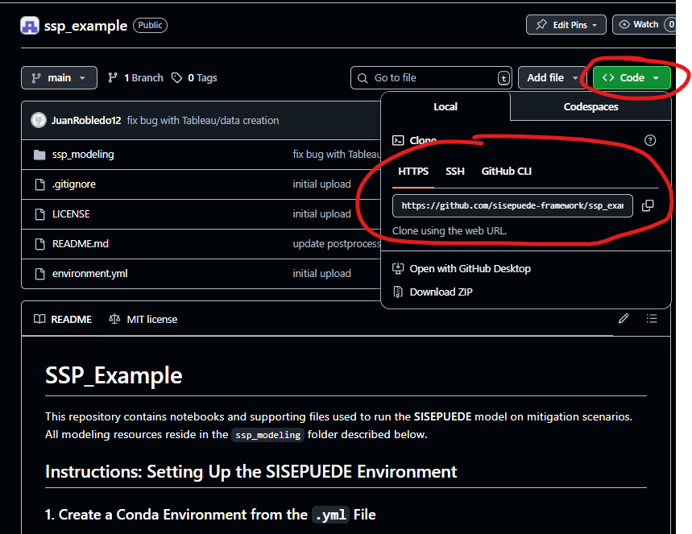
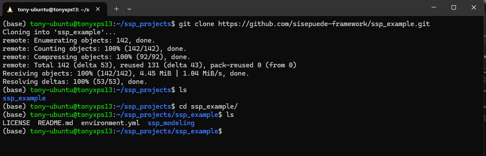
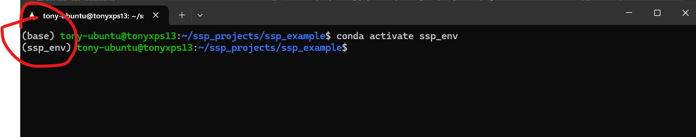
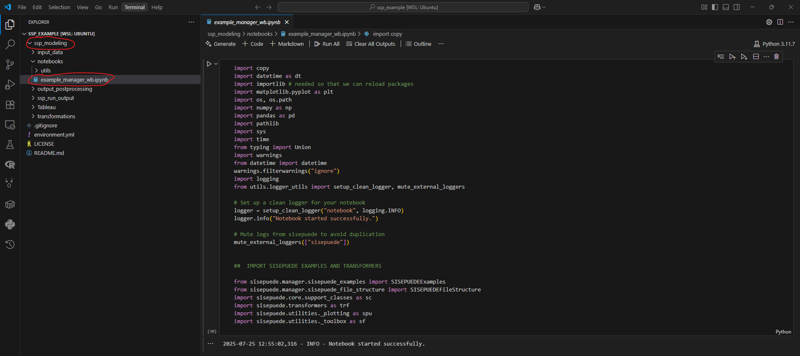

# ssp\_installation\_guide

Guidelines to install and work with SSP

### 1. Setting up the basics

1. Install the code editor VS Code [here](https://code.visualstudio.com/).
2. Go to [GitHub](https://github.com/) and create an account if you don’t have one.
3. Follow the [Git instructions](https://git-scm.com/book/en/v2/Getting-Started-Installing-Git) to install Git in your machine.
4. Open your terminal window:
    * If you are on Windows, open the Git Bash terminal.
    * On any other operating system, you can use your default terminal.
5. In the terminal, run:

```bash
git --version
```
You should see an output similar to this if Git is installed:



>Tip: If you are completly new to the terminal we recommend checking out [this tutorial](https://code.visualstudio.com/docs/terminal/getting-started). Windows users will use PowerShell instructions and MAC/Linux will use bash or Zsh instructions.

### 2. Setting up your Git credentials

Before cloning or working with repositories, you need to configure your Git username and email. These credentials will be associated with your commits.

1. Open your terminal (Git Bash on Windows).
2. Set your username by running:

   ```bash
   git config --global user.name "Your Name"
   ```
3. Set your email address by running:

   ```bash
   git config --global user.email "your_email@example.com"
   ```
4. To verify your configuration, run:

   ```bash
   git config --list
   ```

   You should see your username and email in the output.

   

> **Tip:** Use the same email address you used to create your GitHub account to avoid issues when linking commits to your profile.

### 3. Install Miniconda

Miniconda is a lightweight version of Anaconda that includes only the essential tools to manage environments and packages.

* [Windows Installation Guide Video](https://youtu.be/AgnAs0nPEVg)
* [macOS / Linux Installation Guide](https://www.anaconda.com/docs/getting-started/miniconda/install#macos-linux-installation)

After installing Miniconda, open a new terminal (on Windows, use the **Anaconda PowerShell Prompt**) and verify the installation by running:

```bash
conda --version
```


You should see a version number, confirming that Miniconda is installed correctly.

> **Tip:** On Windows, you can use the **Anaconda PowerShell Prompt** as your default terminal from now on.


### 4. Create a Folder to Clone the SISEPUEDE Repository

1. Open your terminal (**Windows users:** use the **Anaconda PowerShell Prompt**).

2. Navigate to your **Desktop** or any other preferred location on your computer.

3. Create a directory with the following command:

   ```bash
   mkdir ssp_projects
   ```

   You can name the directory whatever you want, but make sure you remember its location so you can access it later.

4. Move into the directory:

   ```bash
   cd ssp_projects
   ```

Your terminal should now look like this:

**Windows example:**


**macOS or Linux example:**


---

### 5. Clone the SISEPUEDE Example Repository

1. Visit the **ssp\_example** GitHub repository [here](https://github.com/sisepuede-framework/ssp_example).
2. Click on the green **<> Code** button and copy the HTTPS link as shown in the image below:
   
3. This process is the same for cloning any SISEPUEDE repository.
4. Open your terminal and, inside the folder you created earlier, run:

   ```bash
   git clone https://github.com/sisepuede-framework/ssp_example.git
   ```

If successful, you should see something like this when you navigate inside the cloned repository:


---

### 6. Install the SISEPUEDE Conda Environment

1. Navigate to the **ssp\_example** directory:

   ```bash
   cd ssp_example
   ```

2. Create the conda environment by running:

   ```bash
   conda env create -f environment.yml
   ```

   This will create a conda environment with **SISEPUEDE** and all its dependencies.

3. Once the environment is created, activate it:

   ```bash
   conda activate ssp_env
   ```

   You should see the prompt change from `(base)` to `(ssp_env)`.
   

> **Tip:** If you are new to conda commands, check out this [cheatsheet](https://docs.conda.io/projects/conda/en/stable/user-guide/cheatsheet.html).

---

### 7. Final Check

1. Open the repository in **VS Code**.
2. Open the notebook located at:
   `ssp_modeling/notebooks/example_manager_wb.ipynb`
3. Run the first cell. If no errors appear, your setup is complete.
   
4. Done! You can now start exploring the notebook and running the model. More tutorials will be available soon.

---

### Extras

* For more in-depth Git/GitHub tutorials, refer to this [guide](https://github.com/jroblar/tutorial_git_ib/blob/main/slides/tutorial_2.md).
  It will help you understand how to create and manage both local and remote repositories.


